# Progress

## Project Milestones

- ✅ **Multi-platform screenshot harness** — Renders the shared `TokamakDemo` catalog (51 entries) to PNG galleries on macOS (40), web (40), iOS (40), and wasm (51 — all entries, incl. the 11 window/scroll-context demos that native/web cannot rasterize). Single source of truth: `Sources/TokamakDemo/DemoCatalog.swift`. See `Scripts/screenshots/generate.sh` and `screenshots/README.md`. iOS gallery fixed in [#30](https://github.com/IGRSoft/Tokamak/issues/30) (NativeDemo Xcode project updated to include all 14 missing demo files added since #28; verified: 39 PNGs, `[verify] OK` — no blanks, no nosign placeholders, no unexpected duplicates). Extended to 51 entries (ImageDemo + DynamicListDemo); iOS updated to 40 PNGs.

## Views and Controls

This section lists views.

Each subsection below ends with a **Gallery** table — that area's demos rendered across `mac`/`web`/`ios`/`wasm`. A `—` cell means that host does not capture the demo (offscreen-rasterization limits; the `wasm` browser path is authoritative). The images come from the screenshot harness — see [`screenshots/README.md`](../screenshots/README.md).

Table columns:

- **Status** — overall: blank = not started · 🚧 = some features work · ✅ = feature-complete
- **View** — name of the view/control
- **DOM** — `TokamakDOM` interactive web renderer
- **SSR** — `TokamakStaticHTML` server-side render
- **wasm** — browser DOM gallery (full catalog; authoritative for `` and JS-gated output)
- **GTK4** — `TokamakGTK4` (Linux; builds in Docker via `Dockerfile.gtk`. After the GTK3→GTK4 attach fix — `gtk_window_set_child` for the window child + real `GtkBox` for stacks — **25 demos render real distinct content** to `screenshots/gtk/<Name>.png`; 26 remain deny-set/no-content. See `screenshots/gtk/UNSUPPORTED.md` for the per-entry split.)
- **What's left** — remaining work for full cross-platform parity

Per-platform cell legend: ✅ complete · 🚧 partial · ◑ renders (partial fidelity; text/layout only; some shapes/buttons render as labels) · ➖ inert no-op (framework limitation) · ❌ not rendered · — not applicable

### Text

| Status | View | DOM | SSR | wasm | GTK4 | What's left |
| :-: | --- | :-: | :-: | :-: | :-: | --- |
| ✅ | [Text](https://developer.apple.com/documentation/swiftui/text) | ✅ | ✅ | ✅ | ◑ | — (rendered) |
| ✅ | [TextField](https://developer.apple.com/documentation/swiftui/textfield) | ✅ | ✅ | ✅ | ◑ | — (rendered) |
| ✅ | [SecureField](https://developer.apple.com/documentation/swiftui/securefield) | ✅ | ✅ | ✅ | ◑ | — (rendered) |
| ✅ | [TextEditor](https://developer.apple.com/documentation/swiftui/texteditor) | ✅ | ✅ | ✅ | ◑ | — (rendered) |

**Notes on Text inputs (Text, TextField, SecureField, Label):**
- ✅ **Text** — `Text: AnyHTML`/`HTMLConvertible` in `TokamakStaticHTML/Views/Text/Text.swift` emits `` on both SSR engines; DOM via the same module. Was already complete; flag corrected.
- ✅ **TextField** — Interactive DOM rendering (`DOMPrimitive` + JS listeners) lives in `TokamakDOM` behind `#if canImport(JavaScriptKit)`, so the server build had NO SSR primitive: the `_PrimitiveView`/`ParentView` descended only to the placeholder label ``, never an `<input>` (same empty-SSR gap class as the selectors). DV adds `TextField: _HTMLPrimitive` + `HTMLConvertible` (`TokamakStaticHTML/Views/Text/TextField.swift`) emitting a static `<input type="text">` (`type="search"` for `RoundedBorderTextFieldStyle`, matching the DOM mapping) with `value`/`placeholder`. Verified on both legacy and Fiber SSR paths.
- ✅ **SecureField** — Same gap: only `DOMPrimitive` (JS-gated), no SSR. DV adds `SecureField: _HTMLPrimitive` + `HTMLConvertible` (`TokamakStaticHTML/Views/Text/SecureField.swift`) emitting `<input type="password">`. The entered value is deliberately NOT echoed into server markup (no secret leak); only the placeholder is surfaced. Cataloged as a standalone `Text/SecureField` demo (was previously only exercised inside the TextField demo).
- ✅ **Label** — Composes via `LabelStyle.makeBody` → `HStack(icon, title)`, so it already rendered through the shared `Image`/`Text` primitives on both DOM + StaticHTML (no per-renderer file needed). Verified by `NewViewsRenderingTests.testLabelRendersIconAndTitle` and `TextInputRenderingTests.testLabelRendersTitleAndIconInSSR`; flag corrected.
- ⚠️ GTK4 not addressed in this batch (no toolchain on host) — the controls retain their existing GTK status; flips above reflect the must-pass DOM + StaticHTML SSR renderers only, which is the feature-complete criterion used for these rows.

**Gallery** — cross-platform renders ( — = not captured on that host; see [why](../screenshots/README.md) ):

| Demo | mac | web | ios | wasm |
| --- | :-: | :-: | :-: | :-: |
| Text | 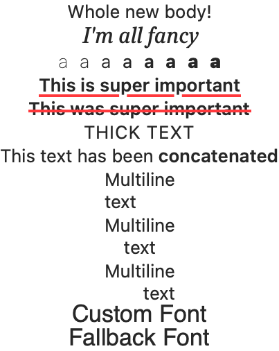 | 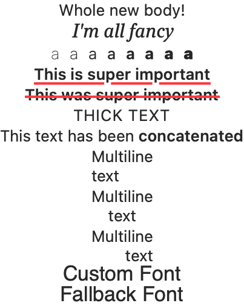 | 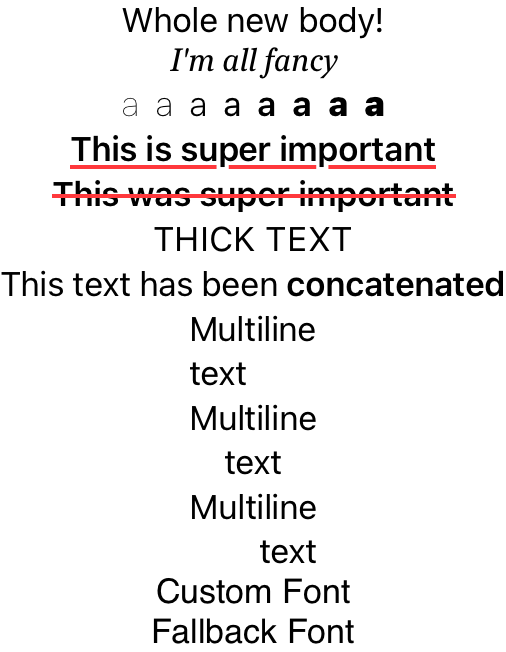 | 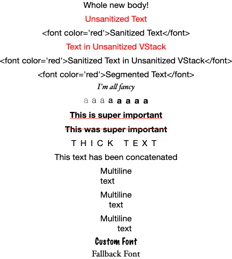 |
| TextField | 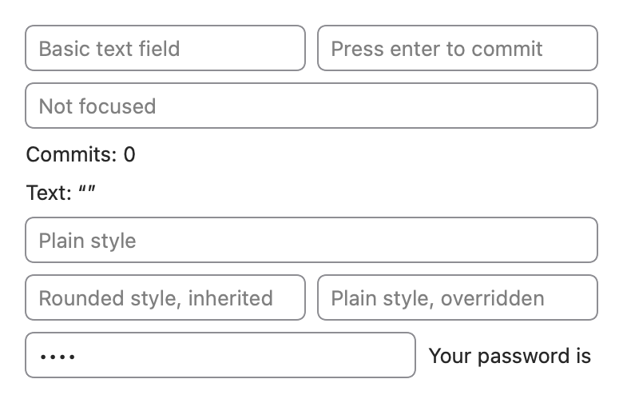 | 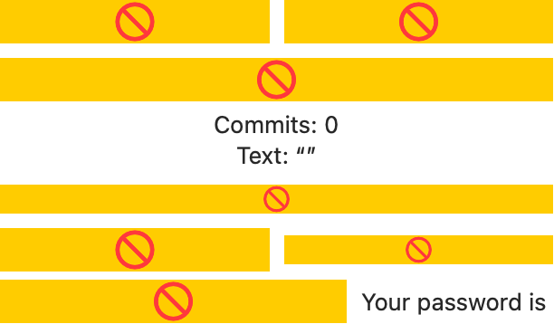 | 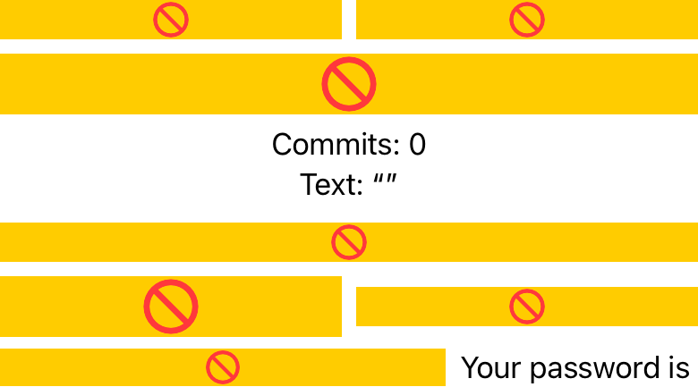 | 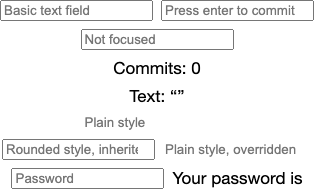 |
| SecureField | 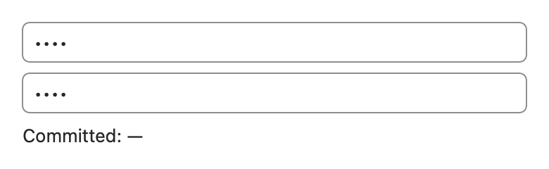 | 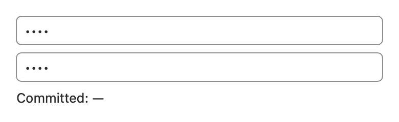 | 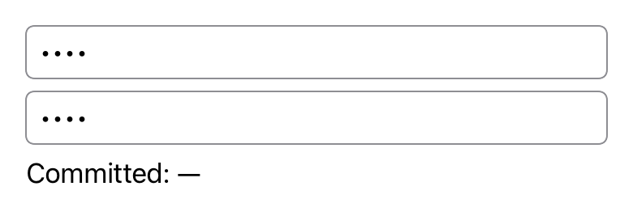 | 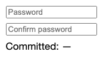 |
| TextEditor |  | 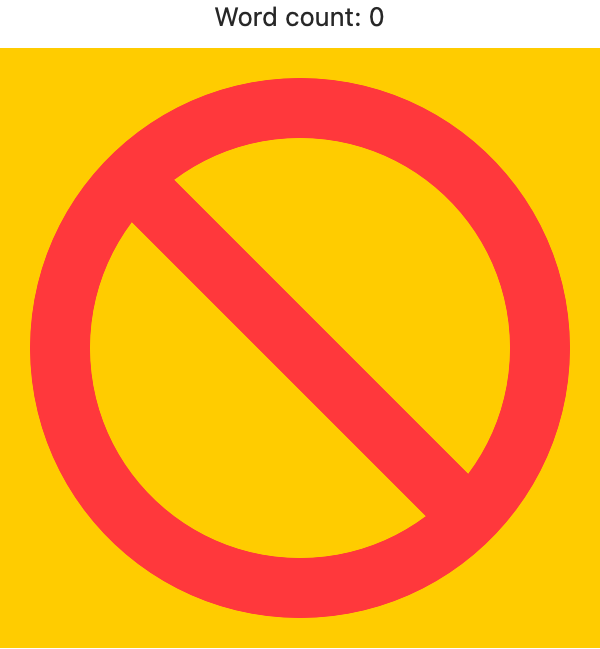 | 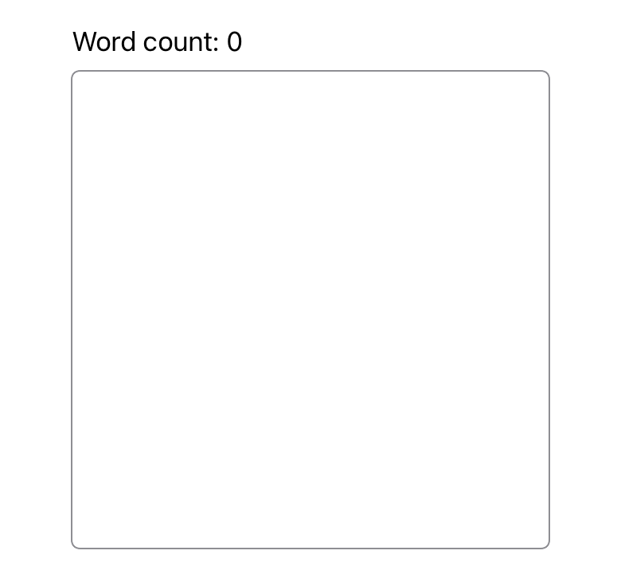 |  |
| Label | — | — | — | 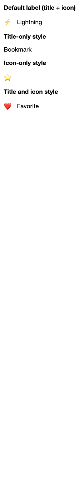 |

### Images

| Status | View | DOM | SSR | wasm | GTK4 | What's left |
| :-: | --- | :-: | :-: | :-: | :-: | --- |
| ✅ | [Image](https://developer.apple.com/documentation/swiftui/image) ¹ | ✅ | ✅ | ✅ | ◑ | SF Symbol glyph rasterization on web (¹ placeholder only); `.renderingMode`/`.interpolation`; GTK4 `system` glyphs (rendered but limited) |

**Notes on Image:**
- ✅ **Works on DOM + StaticHTML SSR** (must-pass, string-assertion tested in
  `Tests/TokamakStaticHTMLTests/ImageRenderingTests.swift`): named/bundle sources, inline
  **data-URI** and remote (`http(s)://`) sources (pass-through ``), `.resizable()`
  (`width/height:100%`), `.aspectRatio`/`.scaledToFit`/`.scaledToFill` (object-fit
  contain/fill via `_tokamak-aspect-ratio-*` classes), accessibility `alt` from the image
  label on **both** SSR paths (legacy `_HTMLPrimitive` and the `HTMLConvertible` path
  TokamakDOM uses — the latter previously dropped `alt` entirely), and decorative images
  (`Image(decorative:)` → `aria-hidden="true"` + empty `alt`).
- ¹ 🚧 **Deferred — SF Symbols**: `Image(systemName:)` exists and renders a stable,
  non-crashing placeholder on the web (a valid `` carrying the symbol name as `alt` +
  `data-sf-symbol`), but **not a real glyph** — Tokamak has no SF Symbol rasterization
  pipeline on the web. `.renderingMode` and `.interpolation` are not yet modeled.
- GTK4: best-effort/inert — `system` images resolve to an empty path (no glyph); named/file
  sources unchanged.
- Gallery note: on a macOS host both `mac` and `web` capture via SwiftUI `ImageRenderer`
  (which cannot rasterize a data-URI `` offscreen), so the gallery uses a pure-SwiftUI
  shape mock (`FallbackImageDemo`). The authoritative DOM render is the wasm path; the
  genuine ``/`alt`/`object-fit` HTML output is verified by the SSR string tests.

**Gallery** — cross-platform renders ( — = not captured on that host; see [why](../screenshots/README.md) ):

| Demo | mac | web | ios | wasm |
| --- | :-: | :-: | :-: | :-: |
| Image | 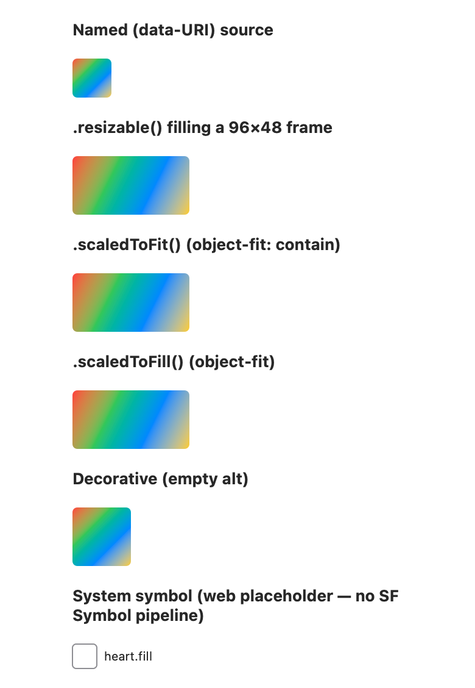 | 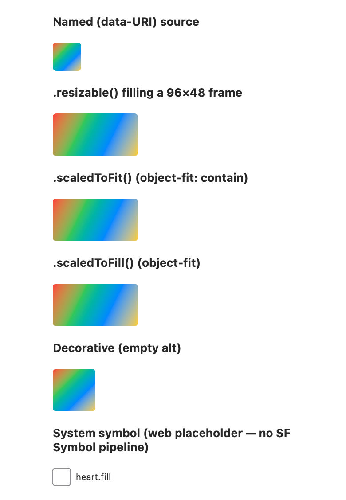 | 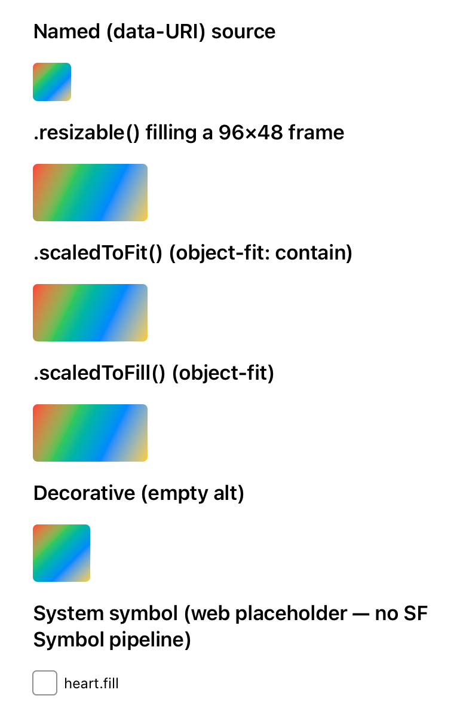 | 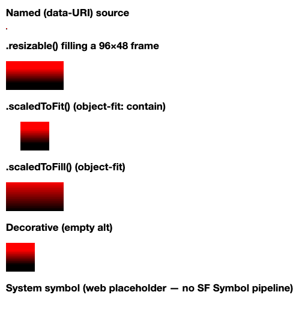 |

### Buttons

| Status | View | DOM | SSR | wasm | GTK4 | What's left |
| :-: | --- | :-: | :-: | :-: | :-: | --- |
| ✅ | [Button](https://developer.apple.com/documentation/swiftui/button) | ✅ | ✅ | ✅ | ◑ | GTK4 rendered (label only) |
| 🚧 | [NavigationLink](https://developer.apple.com/documentation/swiftui/navigationlink) | 🚧 | ➖ | 🚧 | ❌ | StaticHTML conformance; push/pop is JS-only (inert under SSR); GTK4 not rendered |
| ✅ | [EditButton](https://developer.apple.com/documentation/swiftui/editbutton) | ✅ | ✅ | ✅ | ◑ | — (Core-only, drives DynamicViewContent edit state; GTK4 rendered) |
| 🚧 | [PasteButton](https://developer.apple.com/documentation/swiftui/pastebutton) | 🚧 | ➖ | 🚧 | ◑ | UTType/Transferable payloads; clipboard on SSR/GTK4 (DOM = plain-text only; GTK4 rendered as button) |
| 🚧 | [SignInWithAppleButton](https://developer.apple.com/documentation/swiftui/signinwithapplebutton) | 🚧 | 🚧 | 🚧 | ◑ | AuthenticationServices credential flow (visual stand-in only; GTK4 rendered) |
| 🚧 | [Menu](https://developer.apple.com/documentation/swiftui/menu) | ✅ | ✅ | ✅ | ◑ | GTK4 rendered (DOM/SSR `role="menu"` complete) |

**Gallery** — cross-platform renders ( — = not captured on that host; see [why](../screenshots/README.md) ):

| Demo | mac | web | ios | wasm |
| --- | :-: | :-: | :-: | :-: |
| Counter |  | 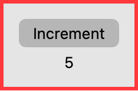 |  | 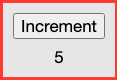 |
| ButtonStyle | 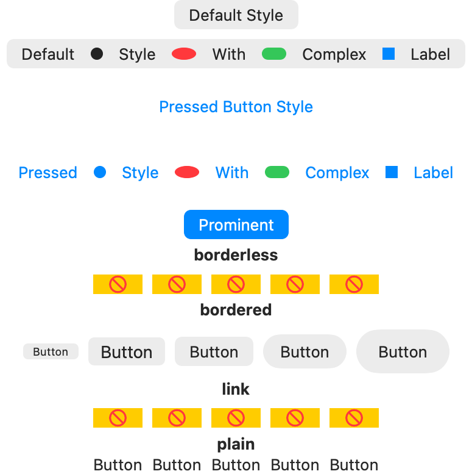 | 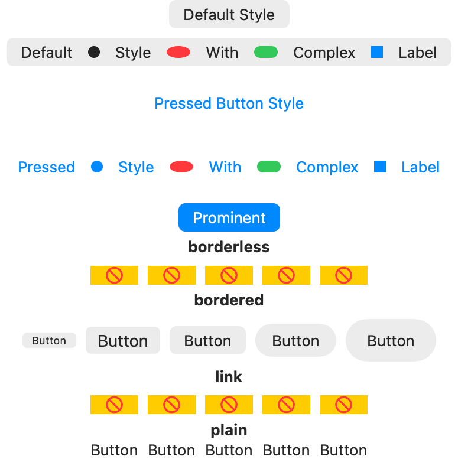 | 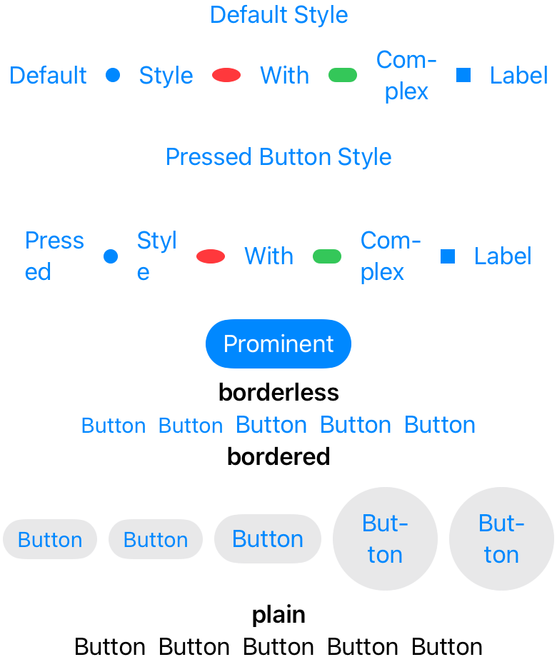 | 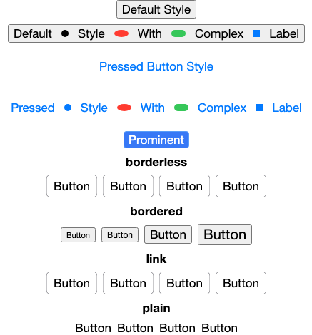 |
| EditButton |  | 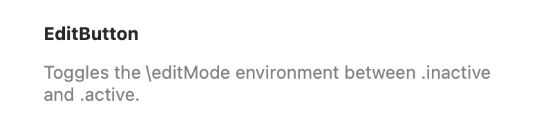 |  | 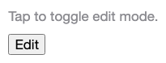 |
| Menu |  |  |  | 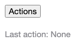 |
| PasteButton |  |  |  | 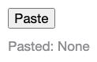 |
| SignInWithAppleButton |  |  |  | 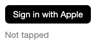 |

### Value Selectors

| Status | View | DOM | SSR | wasm | GTK4 | What's left |
| :-: | --- | :-: | :-: | :-: | :-: | --- |
| ✅ | [Toggle](https://developer.apple.com/documentation/swiftui/toggle) | ✅ | ✅ | ✅ | ❌ | GTK4 not rendered |
| ✅ | [Picker](https://developer.apple.com/documentation/swiftui/picker) | ✅ | ✅ | ✅ | ◑ | GTK4 rendered (label only) |
| ✅ | [DatePicker](https://developer.apple.com/documentation/swiftui/datepicker) | ✅ | ✅ | ✅ | ❌ | GTK4 not rendered |
| ✅ | [Slider](https://developer.apple.com/documentation/swiftui/slider) | ✅ | ✅ | ✅ | ❌ | GTK4 not rendered (mac/web demo skipped — captured via wasm) |
| ✅ | [Stepper](https://developer.apple.com/documentation/swiftui/stepper) | ✅ | ✅ | ✅ | ❌ | GTK4 not rendered |
| ✅ | [ColorPicker](https://developer.apple.com/documentation/swiftui/colorpicker) | ✅ | ✅ | ✅ | ❌ | GTK4 not rendered |

**Notes:**
- ✅ Value Selectors all render on **both** must-pass renderers. DOM emits real interactive
  controls (`Sources/TokamakDOM/Views/Selectors/` — `<input type=range|color|date>`,
  `<select>`, stepper `<button>`s; Toggle via `CheckboxToggleStyle`). StaticHTML SSR was the
  gap — `Sources/TokamakStaticHTML/Views/Selectors/` was empty, so every selector emitted no
  markup under SSR and `Toggle` trapped on the `_ToggleStyleKey` fatalError default. New
  `_HTMLPrimitive` conformances (Slider/Stepper/ColorPicker/DatePicker/Picker) plus a JS-free
  `StaticHTMLToggleStyle` wired into the StaticHTML `defaultEnvironment` close it. Verified by
  `Tests/TokamakStaticHTMLTests/SelectorRenderingTests.swift` (23 SSR string-assertion tests,
  all green) — these are the authoritative DOM/SSR-parity gate.
- ColorPicker/DatePicker/Picker/Stepper/Toggle also produce mac/web gallery PNGs
  (`screenshots/{mac,web}/`). `Slider`'s **demo** is skipped on the mac/web hosts only because
  its root `ScrollView` is unrasterizable offscreen under macOS `ImageRenderer` (the same
  treatment Form/Gauge/Label/Color get — see `screenshots/README.md`); the Slider control
  itself renders correctly on DOM and SSR (covered by the tests above) and is captured
  authoritatively via the wasm browser path.
- GTK4: selector primitives are best-effort only (no GTK4 toolchain on the current host);
  GTK rendering is documented expectation, not blocking.

**Gallery** — cross-platform renders ( — = not captured on that host; see [why](../screenshots/README.md) ):

| Demo | mac | web | ios | wasm |
| --- | :-: | :-: | :-: | :-: |
| ColorPicker | 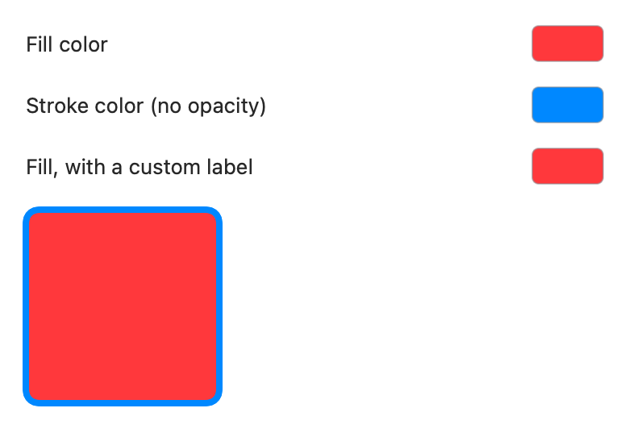 | 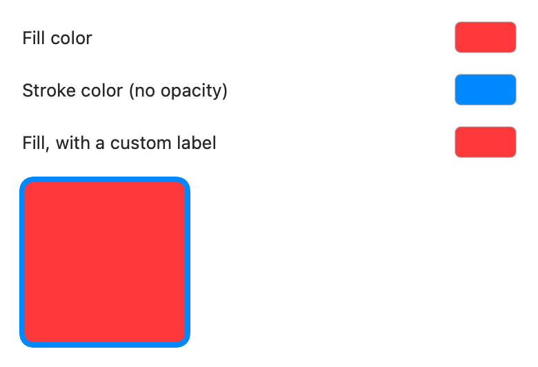 |  | 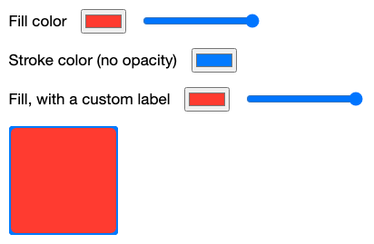 |
| DatePicker |  |  |  | 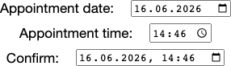 |
| Picker |  | 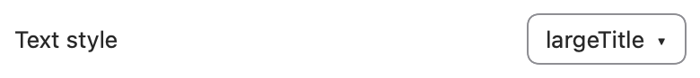 |  |  |
| Slider | — | — | — | 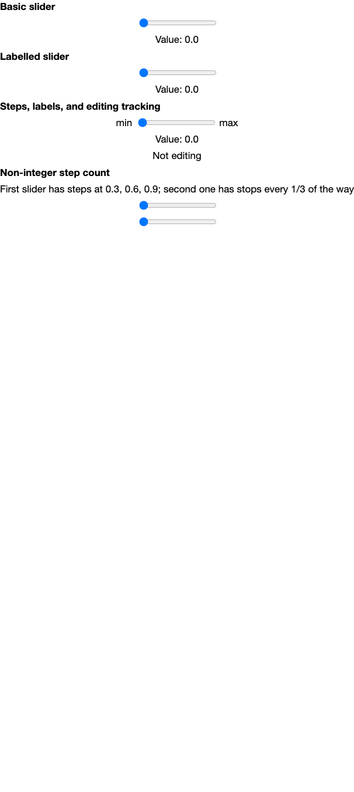 |
| Stepper | 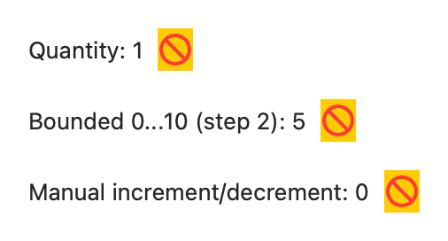 | 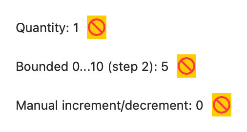 | 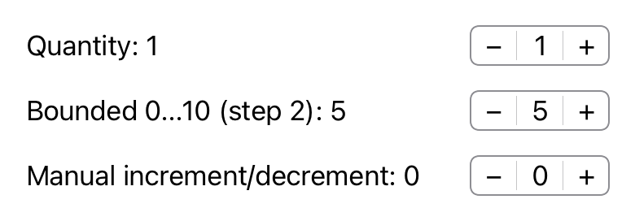 | 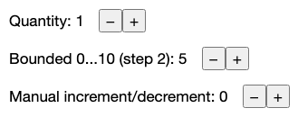 |
| Toggle | 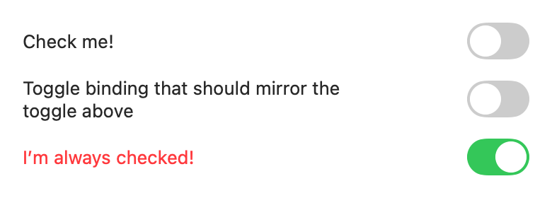 | 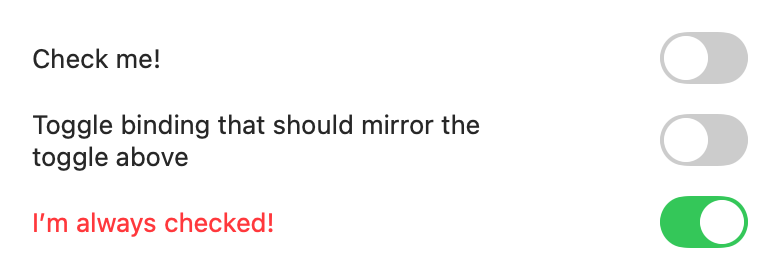 | 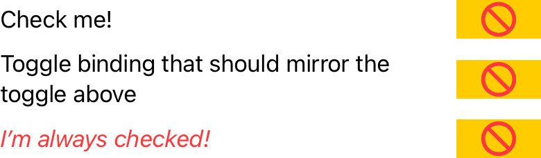 | 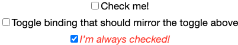 |

### Value Indicators

| Status | View | DOM | SSR | wasm | GTK4 | What's left |
| :-: | --- | :-: | :-: | :-: | :-: | --- |
| ✅ | [ProgressView](https://developer.apple.com/documentation/swiftui/progressview) | ✅ | ✅ | ✅ | ❌ | GTK4 not rendered |
| ✅ | [Gauge](https://developer.apple.com/documentation/swiftui/gauge) | ✅ | ✅ | ✅ | ❌ | GTK4 not rendered |
| ✅ | [Label](https://developer.apple.com/documentation/swiftui/label) | ✅ | ✅ | ✅ | ❌ | (composes Image + Text; GTK4 not rendered as distinct) |
| ✅ | [Link](https://developer.apple.com/documentation/swiftui/link) | ✅ | ✅ | ✅ | ❌ | GTK4 not rendered |

**Notes:**
- ✅ **ProgressView** renders on **both** must-pass renderers. The determinate variant
  (`_FractionalProgressView`) emits a `<progress value=…>`; the indeterminate variant
  (`_IndeterminateProgressView`) emits a valueless `<progress>` (browser-animated). DOM has no
  dedicated primitive — `DOMRenderer` falls back to the shared StaticHTML `_HTMLPrimitive`
  conformances (`Sources/TokamakStaticHTML/Views/Progress/ProgressView.swift`), so DOM + SSR are
  identical. Covered by 4 SSR string-assertion tests in `NewViewsRenderingTests.swift`
  (determinate value, normalize-against-total, valueless indeterminate, label). Demo:
  `Misc/ProgressView` (with `FallbackProgressViewDemo` for the ImageRenderer-unsafe gallery path).
- ✅ **Gauge** renders on **both** must-pass renderers. The default/linear style (`_GaugeView`)
  emits a `<meter value min max>`; `AccessoryCircularGaugeStyle` (`_CircularGaugeView`) emits an
  `<svg>` with track + progress arc `<path>`s. Shared StaticHTML `_HTMLPrimitive` conformances
  (`Sources/TokamakStaticHTML/Views/Progress/Gauge.swift`) serve DOM via fallback. Covered by 4
  SSR tests (linear meter, fraction clamping, circular SVG arc, custom GaugeStyle). Demo:
  `Misc/Gauge` (cataloged with `needsWindowContext: true` — its root `ScrollView` is captured
  via the window-context path, the same treatment as Form).
- GTK4: ProgressView/Gauge are best-effort only (no GTK4 toolchain on the current host).

**Gallery** — cross-platform renders ( — = not captured on that host; see [why](../screenshots/README.md) ):

| Demo | mac | web | ios | wasm |
| --- | :-: | :-: | :-: | :-: |
| ProgressView | 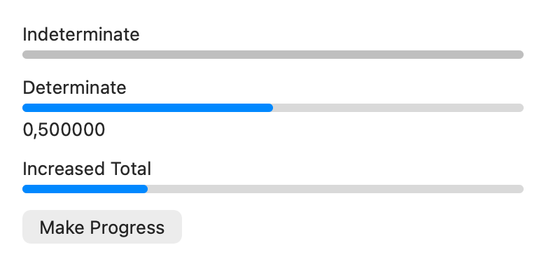 | 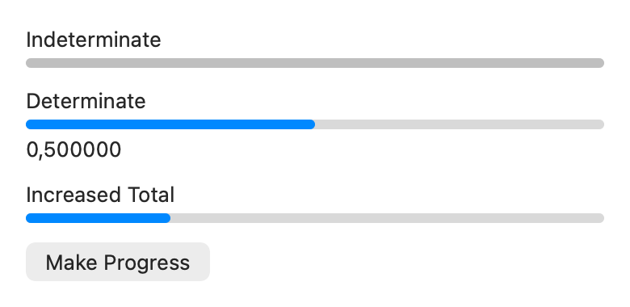 | 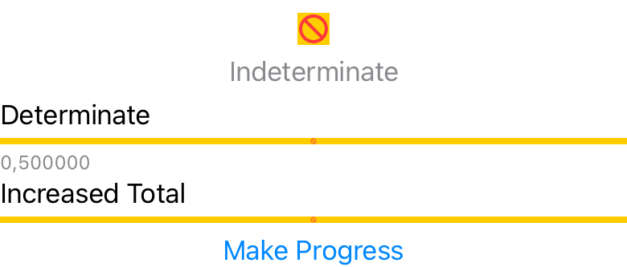 | 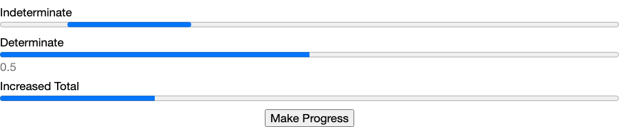 |
| Gauge | — | — | — | 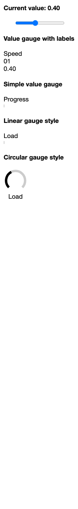 |

## View Layout and Presentation

### Stacks

| Status | View | DOM | SSR | wasm | GTK4 | What's left |
| :-: | --- | :-: | :-: | :-: | :-: | --- |
| ✅ | [HStack](https://developer.apple.com/documentation/swiftui/hstack) | ✅ | ✅ | ✅ | ◑ | GTK4 rendered |
| ✅ | [VStack](https://developer.apple.com/documentation/swiftui/vstack) | ✅ | ✅ | ✅ | ◑ | GTK4 rendered |
| ✅ | [ZStack](https://developer.apple.com/documentation/swiftui/zstack) | ✅ | ✅ | ✅ | ◑ | GTK4 rendered |
| ✅ | [LazyHStack](https://developer.apple.com/documentation/swiftui/lazyhstack) | ✅ | ✅ | ✅ | ❌ | GTK4 not rendered |
| ✅ | [LazyVStack](https://developer.apple.com/documentation/swiftui/lazyvstack) | ✅ | ✅ | ✅ | ❌ | GTK4 not rendered |

**Gallery** — cross-platform renders ( — = not captured on that host; see [why](../screenshots/README.md) ):

| Demo | mac | web | ios | wasm |
| --- | :-: | :-: | :-: | :-: |
| HStack/VStack | 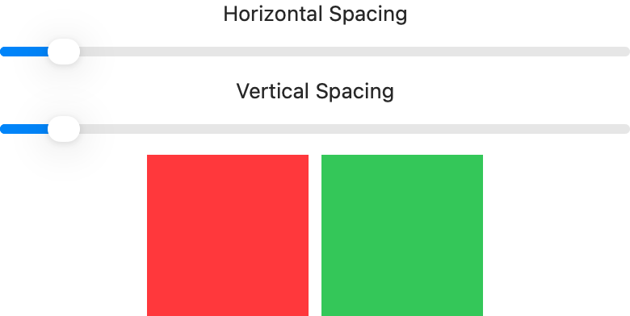 | 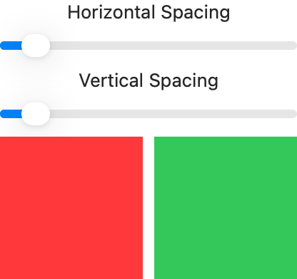 | 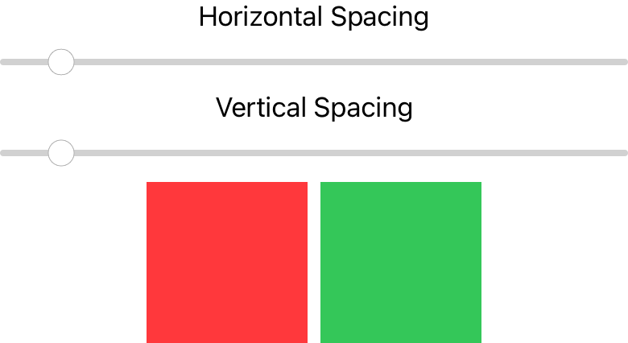 | 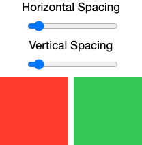 |
| LazyVStack/LazyHStack | — | — | — | 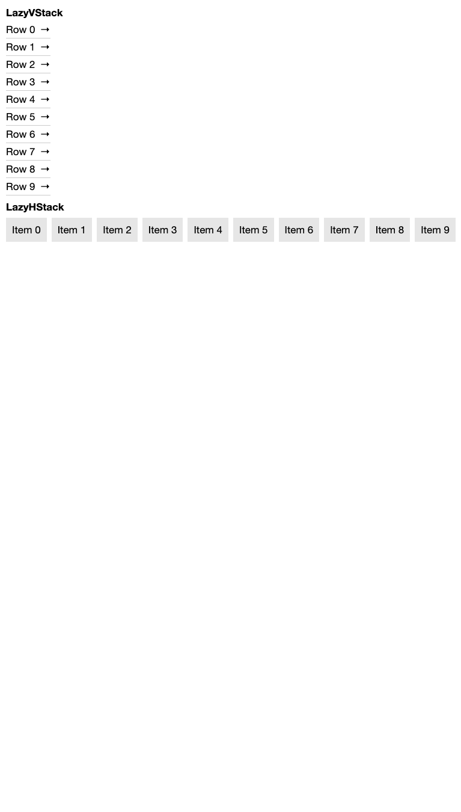 |
| ZStack |  |  |  |  |

### Grids

| Status | View | DOM | SSR | wasm | GTK4 | What's left |
| :-: | --- | :-: | :-: | :-: | :-: | --- |
| ✅ | [LazyHGrid](https://developer.apple.com/documentation/swiftui/lazyhgrid) | ✅ | ✅ | ✅ | ❌ | Native GTK4 grid (composite fallback only; not rendered) |
| ✅ | [LazyVGrid](https://developer.apple.com/documentation/swiftui/lazyvgrid) | ✅ | ✅ | ✅ | ❌ | Native GTK4 grid (composite fallback only; not rendered) |
| ✅ | [GridItem](https://developer.apple.com/documentation/swiftui/griditem) | ✅ | ✅ | ✅ | ❌ | (config struct; consumed by grids; not rendered) |

**Gallery** — cross-platform renders ( — = not captured on that host; see [why](../screenshots/README.md) ):

| Demo | mac | web | ios | wasm |
| --- | :-: | :-: | :-: | :-: |
| Grid | 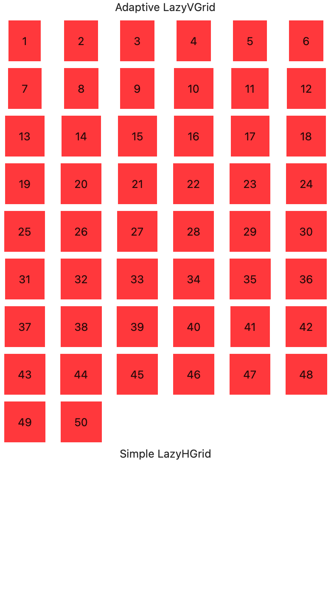 | 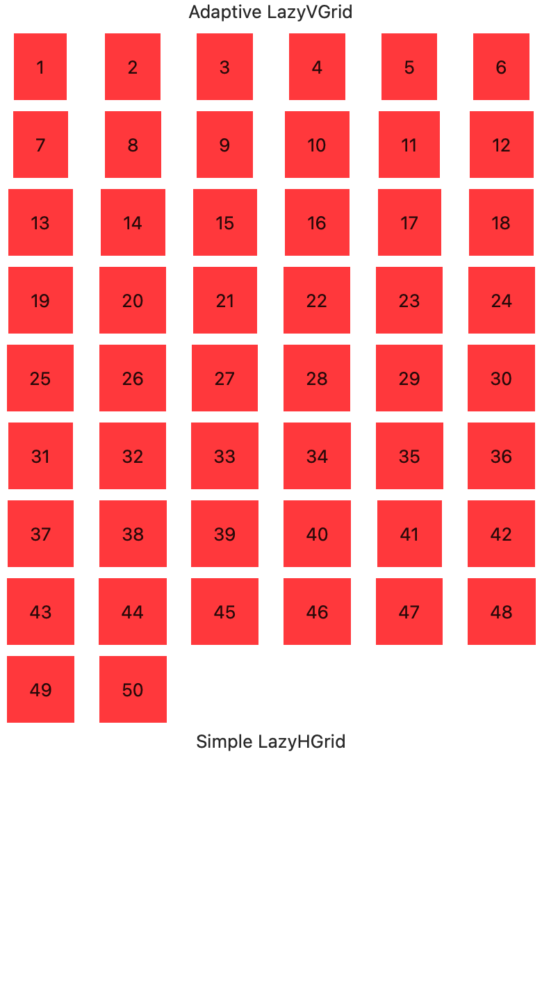 | 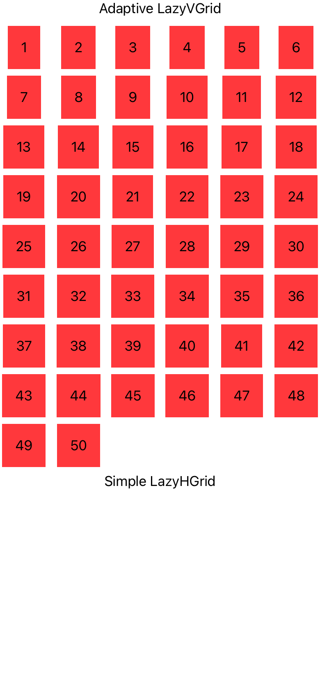 | 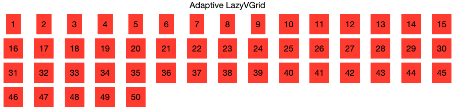 |

### Lists and Scroll Views

| Status | View | DOM | SSR | wasm | GTK4 | What's left |
| :-: | --- | :-: | :-: | :-: | :-: | --- |
| ✅ | [List](https://developer.apple.com/documentation/swiftui/list) | ✅ | ✅ | ✅ | ❌ | GTK4 not rendered |
| ✅ | [ForEach](https://developer.apple.com/documentation/swiftui/foreach) | ✅ | ✅ | ✅ | ◑ | (structural; children render via own primitives; GTK4 renders) |
| ✅ | [ScrollView](https://developer.apple.com/documentation/swiftui/scrollview) | ✅ | ✅ | ✅ | ❌ | GTK4 not rendered; programmatic scroll is JS-only (see Reader/Proxy) |
| 🚧 | [ScrollViewReader](https://developer.apple.com/documentation/swiftui/scrollviewreader) | 🚧 | ➖ | 🚧 | ❌ | Programmatic `scrollTo` needs JS (no-op under SSR); GTK4 not rendered |
| 🚧 | [ScrollViewProxy](https://developer.apple.com/documentation/swiftui/scrollviewproxy) | 🚧 | ➖ | 🚧 | ❌ | Programmatic `scrollTo` needs JS (inert-safe under SSR); GTK4 not rendered |
| ✅ | [DynamicViewContent](https://developer.apple.com/documentation/swiftui/dynamicviewcontent) | ✅ | ✅ | ✅ | ◑ | Native drag-to-reorder (JS/DOM events); `.onInsert`; GTK4 rendered |

**Gallery** — cross-platform renders ( — = not captured on that host; see [why](../screenshots/README.md) ):

| Demo | mac | web | ios | wasm |
| --- | :-: | :-: | :-: | :-: |
| List | — | — | — | 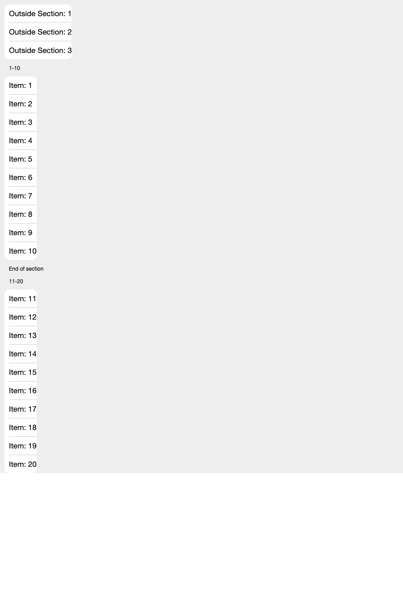 |
| ForEach |  | 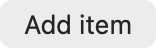 |  |  |
| ScrollViewReader | — | — | — | 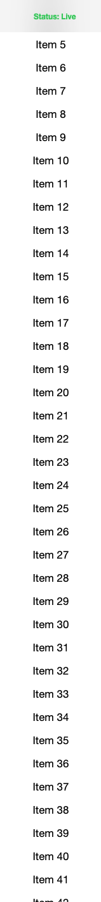 |
| DynamicViewContent | — | — | — | 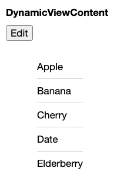 |
| Sidebar | — | — | — | 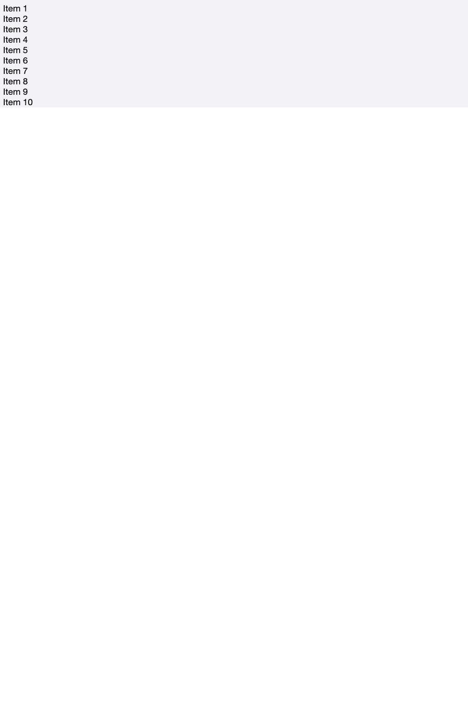 |

### Container Views

| Status | View | DOM | SSR | wasm | GTK4 | What's left |
| :-: | --- | :-: | :-: | :-: | :-: | --- |
| ✅ | [Form](https://developer.apple.com/documentation/swiftui/form) | ✅ | ✅ | ✅ | ❌ | GTK4 not rendered (via List) |
| ✅ | [Group](https://developer.apple.com/documentation/swiftui/group) | ✅ | ✅ | ✅ | ◑ | (transparent grouping; GTK4 renders via children) |
| ✅ | [GroupBox](https://developer.apple.com/documentation/swiftui/groupbox) | ✅ | ✅ | ✅ | ❌ | GTK4 not rendered (DOM `<fieldset>`, SSR bordered VStack) |
| ✅ | [Section](https://developer.apple.com/documentation/swiftui/section) | ✅ | ✅ | ✅ | ❌ | GTK4 not rendered (via List rows) |

**Gallery** — cross-platform renders ( — = not captured on that host; see [why](../screenshots/README.md) ):

| Demo | mac | web | ios | wasm |
| --- | :-: | :-: | :-: | :-: |
| Form & GroupBox | — | — | — |  |

### Hierarchical Views

| Status | View | DOM | SSR | wasm | GTK4 | What's left |
| :-: | --- | :-: | :-: | :-: | :-: | --- |
| ✅ | [OutlineGroup](https://developer.apple.com/documentation/swiftui/outlinegroup) | ✅ | ✅ | ✅ | ❌ | GTK4 not rendered; SSR renders fully expanded (no JS toggle) |
| ✅ | [DisclosureGroup](https://developer.apple.com/documentation/swiftui/disclosuregroup) | ✅ | ✅ | ✅ | ❌ | GTK4 not rendered; SSR renders expanded (DOM keeps interactive chevron) |

**Gallery** — cross-platform renders ( — = not captured on that host; see [why](../screenshots/README.md) ):

| Demo | mac | web | ios | wasm |
| --- | :-: | :-: | :-: | :-: |
| OutlineGroup |  |  |  | 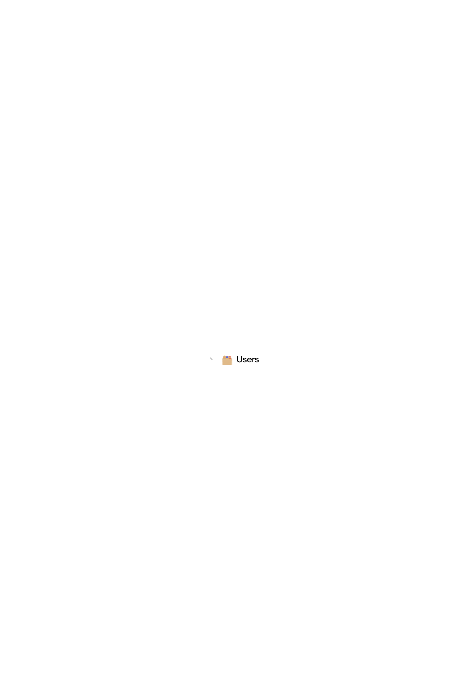 |
| DisclosureGroup |  |  |  | 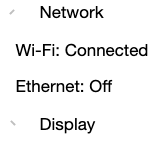 |

### Spacers and Dividers

| Status | View | DOM | SSR | wasm | GTK4 | What's left |
| :-: | --- | :-: | :-: | :-: | :-: | --- |
| ✅ | [Spacer](https://developer.apple.com/documentation/swiftui/spacer) | ✅ | ✅ | ✅ | ◑ | GTK4 rendered |
| ✅ | [Divider](https://developer.apple.com/documentation/swiftui/divider) | ✅ | ✅ | ✅ | ❌ | GTK4 not rendered (best-effort) |

**Notes:**
- ✅ **Divider** renders on **both** must-pass renderers. It emits a colorScheme-aware `
`
  (1px bottom border) on both the legacy `_HTMLPrimitive`/`AnyHTML` path
  (`Sources/TokamakStaticHTML/Views/Spacers/Divider.swift`) and the dynamic-layout Fiber path
  via the `HTMLConvertible` conformance (`DividerSpacer.swift`); DOM reuses the same conformances
  through `DOMRenderer`'s `_HTMLPrimitive` fallback. Covered by `NewViewsRenderingTests.swift`
  (`testDividerRendersHR`, legacy oracle, + `testDividerRendersHRViaFiber`, the conformance that
  actually exercises the Fiber path). Rendered in-context across multiple gallery demos
  (`RedactDemo`, `SplitView`, layout demos). GTK4 is best-effort (no toolchain on host).

**Gallery** — cross-platform renders ( — = not captured on that host; see [why](../screenshots/README.md) ):

| Demo | mac | web | ios | wasm |
| --- | :-: | :-: | :-: | :-: |
| Spacer |  | 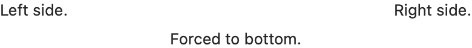 |  | 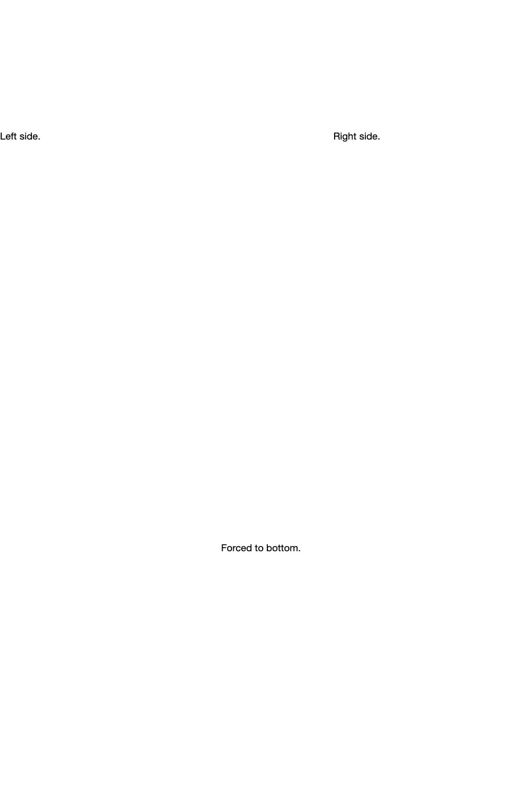 |

### GeometryReader

| Status | View | DOM | SSR | wasm | GTK4 | What's left |
| :-: | --- | :-: | :-: | :-: | :-: | --- |
| ✅ | [GeometryReader](https://developer.apple.com/documentation/swiftui/geometryreader) | ✅ | ✅ | ✅ | ❌ | GTK4 not rendered |

**Gallery** — cross-platform renders ( — = not captured on that host; see [why](../screenshots/README.md) ):

| Demo | mac | web | ios | wasm |
| --- | :-: | :-: | :-: | :-: |
| GeometryReader |  |  |  | 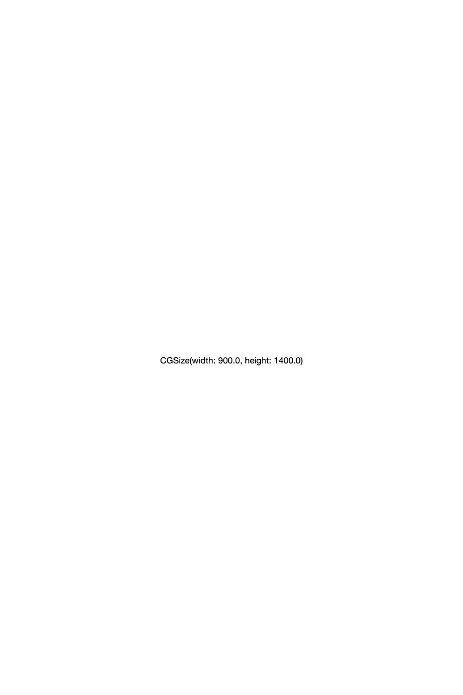 |

### Architectural Views

| Status | View | DOM | SSR | wasm | GTK4 | What's left |
| :-: | --- | :-: | :-: | :-: | :-: | --- |
| 🚧 | [NavigationView](https://developer.apple.com/documentation/swiftui/navigationview) | 🚧 | ➖ | 🚧 | ❌ | Stateful — SSR rejects/emits empty by design; nav chrome is DOM/runtime; GTK4 not rendered |
| 🚧 | [TabView](https://developer.apple.com/documentation/swiftui/tabview) | ✅ | ✅ | ✅ | ◑ | GTK4 rendered (label only); DOM/SSR `role="tablist"` complete |
| 🚧 | [HSplitView](https://developer.apple.com/documentation/swiftui/hsplitview) | ✅ | ✅ | ✅ | ◑ | Draggable resize handles (GtkPaned); GTK4 rendered (static layout) |
| 🚧 | [VSplitView](https://developer.apple.com/documentation/swiftui/vsplitview) | ✅ | ✅ | ✅ | ◑ | Draggable resize handles (GtkPaned); GTK4 rendered (static layout) |

**Foundational-views audit (DOM + StaticHTML SSR verified on macOS host; GTK4 = best-effort/untested):**

Every ✅ below is scoped to the two must-pass renderers (DOM + StaticHTML SSR), each pinned
by a deterministic SSR string-assertion test in
`Tests/TokamakStaticHTMLTests/NewViewsRenderingTests.swift`. GTK4 is untested on this host and
does not gate these flips.

- ✅ **HStack / VStack** — `_HTMLPrimitive` (legacy SSR) + `HTMLConvertible` (DOM + dynamic-layout
  Fiber). Emit `_tokamak-stack` + `_tokamak-hstack`/`_tokamak-vstack`, preserve child order, and
  emit `--tokamak-stack-gap` for custom spacing.
- ✅ **ZStack** — `_HTMLPrimitive` lowering to a single-cell CSS grid (`display: grid`, children
  share `grid-area: a`) so children overlap; renders on DOM via the generic `LayoutView`
  Fiber path.
- ✅ **LazyHStack / LazyVStack** — structurally equivalent to HStack/VStack (same stack classes +
  gap variable); `HTMLConvertible` on both renderers.
- ✅ **List** — composed `View` (not a primitive); lowers to stacks + rows and renders all rows in
  order identically on DOM and StaticHTML SSR.
- ✅ **ForEach** — structural view; children render through their own primitives. Array-id and
  `Range` forms both render every element in order.
- ✅ **ScrollView** — `_HTMLPrimitive` + `HTMLConvertible`; emits a `_tokamak-scrollview` container
  with correct overflow axis (`overflow-y: auto` default, `overflow-x: auto` horizontal). Static
  scroll markup is complete on both renderers; only *programmatic* scrolling is JS-only (see
  ScrollViewReader/Proxy below).
- ✅ **Button** — `_PrimitiveButtonStyleBody: HTMLConvertible` (tag `button`, Fiber path) mirroring
  the DOM `DOMNodeConvertible` mapping; emits `<button>` + `_tokamak-buttonstyle-reset` + label on
  DOM and the dynamic-layout SSR path.
- ✅ **EquatableView** — transparent pass-through; renders byte-identically to its wrapped content.
- ✅ **EditButton** — Core-only, renders via Button; fully cross-platform (DOM/StaticHTML/GTK4).
  Now drives a visible state change end-to-end: a `List` whose rows come from a `ForEach`
  carrying `.onDelete`/`.onMove` renders delete/reorder affordances while the shared
  `\.editMode` binding is `.active` (see the DynamicViewContent note in the grids/containers
  block).

**Stayed 🚧 — honest, renderer-specific reasons (not GTK4-only):**

- 🚧 **ScrollViewReader / ScrollViewProxy** — wrapped content renders on DOM/StaticHTML
  (`_tokamak-scrollviewreader` wrapper) and the SSR proxy is inert-safe (`scrollTo` is a no-op,
  does not crash). Programmatic scrolling (`ScrollViewProxy.scrollTo`) requires JS and does
  nothing under SSR — the JS-dependent behavior is why these stay 🚧.
- 🚧 **NavigationView** — STATEFUL (owns the navigation selection). The legacy `StaticHTMLRenderer`
  oracle traps for stateful views ("Stateful apps cannot be created with TokamakStaticHTML"), and
  the dynamic-layout `StaticHTMLFiberRenderer` emits an empty `<!doctype html></html>` with no
  chrome and none of the wrapped content (verified empirically this pass). Navigation chrome +
  stack behavior is a DOM/runtime feature, not static SSR. Test
  `testNavigationViewIsRejectedByLegacyStaticRenderer` pins this so it cannot silently regress.
- 🚧 **NavigationLink** — only a JavaScriptKit-gated `DOMPrimitive` conformance (no StaticHTML
  conformance); push/pop activation is JS-dependent and inert under SSR.

**Architectural / interactive controls (DOM + StaticHTML SSR complete; stay 🚧 for GTK4 / draggable-handle reasons):**

- 🚧 **Menu** — DOM/StaticHTML complete (`_MenuContainer: HTMLConvertible`, `role="menu"`, label
  before items, items as `<button>` on the Fiber path); GTK4 best-effort (untested on this host;
  requires Linux/GTK4 environment).
- 🚧 **TabView** — DOM/StaticHTML complete (`role="tablist"`/`role="tab"`, both tab labels +
  selected panel content render); GTK4 not buildable on this host (no system GTK4 libs); requires
  Linux/GTK4 environment for verification.
- 🚧 **HSplitView / VSplitView** — Core (`_HSplitContainer`/`_VSplitContainer`) + DOM/StaticHTML
  complete on BOTH SSR paths (`_HTMLPrimitive` + `HTMLConvertible`): flex panes
  (`flex-direction: row`/`column`) with static `_tokamak-splitview-divider`s, verified via the
  legacy oracle and the Fiber path. GTK4 best-effort via HStack/VStack + Divider (untested on this
  host). Draggable resize handles out of scope (TODO: GtkPaned) — that interactive gap is why these
  stay 🚧.
- 🚧 **PasteButton** — `PasteButton(payloadAction:)` plain-text variant (no UTType/Transferable). DOM reads `navigator.clipboard.readText()` via `JSPromise`; StaticHTML/GTK4 render the button with no-payload (clipboard TODO)
- 🚧 **SignInWithAppleButton** — Visual stand-in (no AuthenticationServices): standard black rounded button on DOM/StaticHTML, labelled button on GTK4. `onTap` fires but produces no credential (documented)

**Notes on grids + containers (P4 gap-closing batch):** the ✅ status below is scoped to the
two must-pass renderers — **DOM** and **StaticHTML SSR** — both verified by string-assertion
tests (`Tests/TokamakStaticHTMLTests/ContainerRenderingTests.swift`) and the regenerated
`mac`/`web` galleries. GTK4 is best-effort and **unverified on this host** (no system GTK4
toolchain); none of these have a dedicated `GTKPrimitive`, so GTK4 relies on composite
decomposition into already-supported primitives (Stack/List/ScrollView/Divider).
- ✅ **LazyHGrid / LazyVGrid / GridItem** — DOM + StaticHTML SSR emit a CSS-grid `
`
  (`display: grid` with `grid-template-rows`/`grid-template-columns` derived from each
  `GridItem`'s track size + alignment + spacing). `GridItem` is the config struct the grids
  consume via `.description`; it needs no renderer of its own. Both `_HTMLPrimitive` (SSR
  oracle) and `HTMLConvertible` (Fiber) paths covered. Demo: Layout/Grid (`GridDemo`). GTK4:
  no native grid primitive (composite fallback, untested).
- ✅ **Form** — Composite delegating to `List`; renders identically to its underlying List on
  DOM + StaticHTML SSR (`testFormRendersListStructure`). Demo: Containers/Form & GroupBox
  (full-width layout — root `ScrollView`, captured via wasm). GTK4 via List (untested).
- ✅ **GroupBox** — `DefaultGroupBoxStyle` renders a bordered VStack (label + content) on
  StaticHTML SSR; DOM emits a `<fieldset>`/`<legend>` (JS-gated). Both verified
  (`testGroupBoxRendersLabelAndContent`, `testGroupBoxTitleInitializer`). Demoed within
  Form & GroupBox. GTK4 via VStack/border (untested).
- ✅ **Section** — Composite consumed by `List`; header/content/footer rows all present in SSR
  (`testSectionRendersHeaderAndContent`, `testSectionFooterRendered`). Demoed within Form &
  GroupBox and List. GTK4 via List rows (untested).
- ✅ **DisclosureGroup** — New StaticHTML SSR `_HTMLPrimitive` + `HTMLConvertible`
  (`TokamakStaticHTML/Views/Containers/DisclosureGroup.swift`) renders the group **expanded**
  (label + content, `role="tree"`/`role="treeitem"`, `aria-expanded="true"`) since SSR has no
  JS to toggle — mirroring the `_MenuContainer` SSR treatment and the DOM `DOMPrimitive`
  structure (the DOM path keeps the interactive collapsible chevron). Verified
  (`testDisclosureGroup*`). Demo: Containers/DisclosureGroup (`DisclosureGroupDemo`). GTK4 via
  VStack (untested).
- ✅ **OutlineGroup** — Composite over `ForEach` + `DisclosureGroup`; nested hierarchy renders
  fully expanded in SSR now that DisclosureGroup has an SSR primitive
  (`testOutlineGroupRendersNestedHierarchyExpanded`). Demo: Containers/OutlineGroup. GTK4 via
  DisclosureGroup decomposition (untested).
- ✅ **DynamicViewContent** — `DynamicViewContent` protocol (`var data`) in TokamakCore with
  `ForEach` conformance; `.onDelete(perform:)` / `.onMove(perform:)` modifiers return a
  `_DynamicViewContentWrapper` carrying the closures (type-erased via
  `_DynamicViewContentProtocol`) while transparently re-exposing the wrapped content's `data`
  and children. `List` reads `\.editMode` and, when editing, decorates each dynamic row with a
  "Delete" control (wired to `onDelete([index])`) plus "Up"/"Down" reorder controls (wired to
  `onMove`). Renders + tested on **DOM and StaticHTML SSR** (9 tests in
  `DynamicViewContentRenderingTests`). This is what makes **EditButton** drive a visible
  end-to-end state change. **Deferred:** native pointer drag-to-reorder (HTML5 drag-and-drop
  needs JS/DOM event wiring) — reorder is exposed via discrete Up/Down buttons, nothing faked;
  `.onInsert(of:perform:)` not implemented (needs UTType/Transferable groundwork). GTK4 inherits
  the Core Button-based composition but is untested on this host.

**Gallery** — cross-platform renders ( — = not captured on that host; see [why](../screenshots/README.md) ):

| Demo | mac | web | ios | wasm |
| --- | :-: | :-: | :-: | :-: |
| TabView | 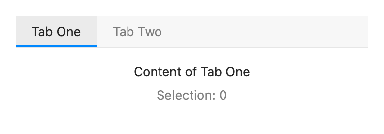 | 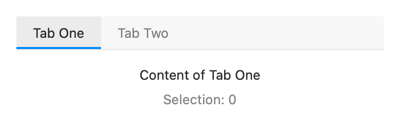 | 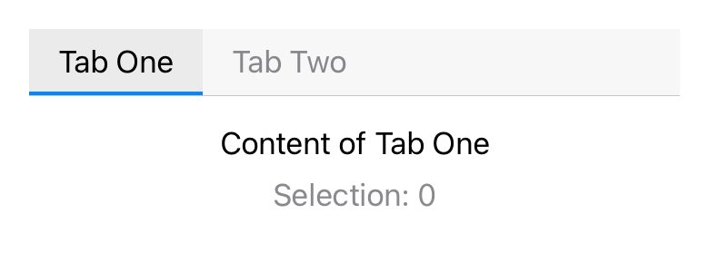 | 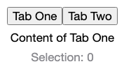 |
| HSplitView | 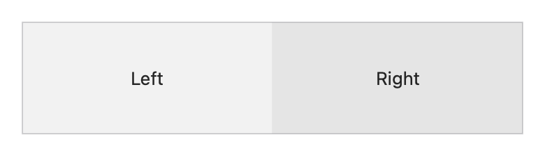 | 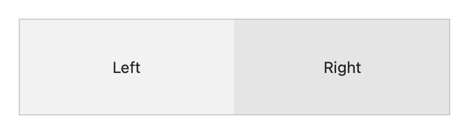 | 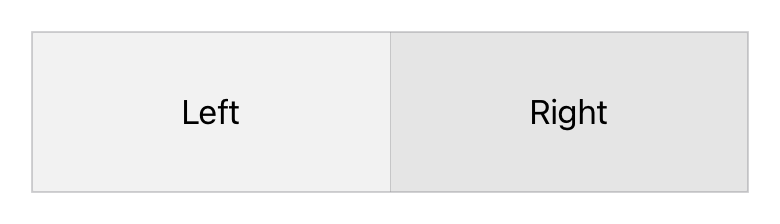 | 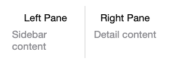 |
| VSplitView | 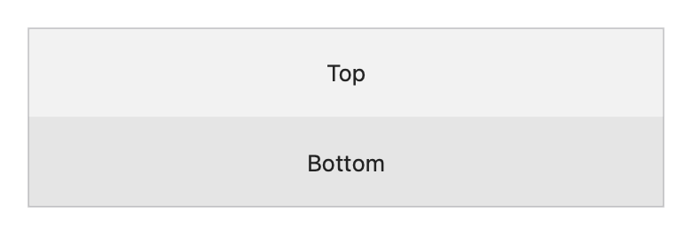 | 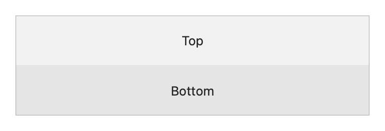 | 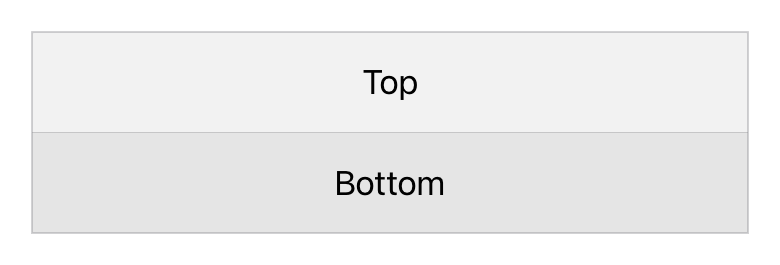 | 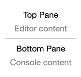 |

### Conditionally Visible Items

| Status | View | DOM | SSR | wasm | GTK4 | What's left |
| :-: | --- | :-: | :-: | :-: | :-: | --- |
| ✅ | [EmptyView](https://developer.apple.com/documentation/swiftui/emptyview) | ✅ | ✅ | ✅ | ◑ | GTK4 renders (no-op) |
| ✅ | [EquatableView](https://developer.apple.com/documentation/swiftui/equatableview) | ✅ | ✅ | ✅ | ◑ | (transparent pass-through; GTK4 renders) |

### Infrequently Used Views

| Status | View | DOM | SSR | wasm | GTK4 | What's left |
| :-: | --- | :-: | :-: | :-: | :-: | --- |
| ✅ | [AnyView](https://developer.apple.com/documentation/swiftui/anyview) | ✅ | ✅ | ✅ | ◑ | GTK4 renders (transparent pass-through) |
| ✅ | [TupleView](https://developer.apple.com/documentation/swiftui/tupleview) | ✅ | ✅ | ✅ | ◑ | GTK4 renders (transparent pass-through) |

### Gestures

| Status | View | DOM | SSR | wasm | GTK4 | What's left |
| :-: | --- | :-: | :-: | :-: | :-: | --- |
| 🚧 | Gesture handlers | 🚧 | ➖ | 🚧 | ◑ | Tap/drag event binding (DOM = JS gesture events); GTK4 rendered (demo content rendered but no gesture response) |

**Gallery** — cross-platform renders ( — = not captured on that host; see [why](../screenshots/README.md) ):

| Demo | mac | web | ios | wasm |
| --- | :-: | :-: | :-: | :-: |
| Gestures | 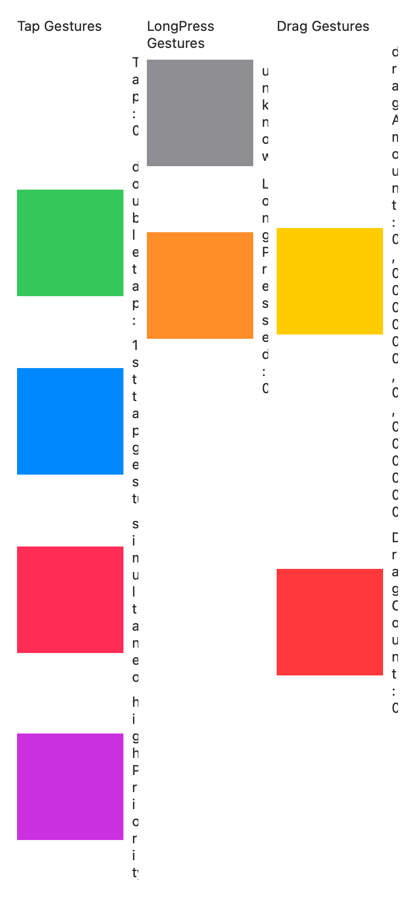 | 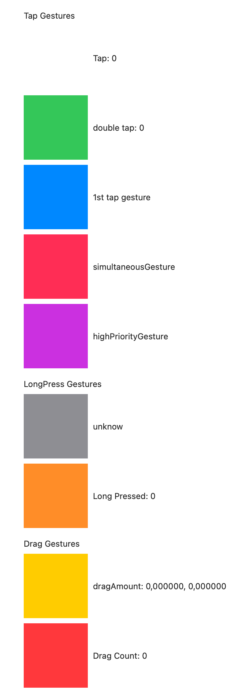 | 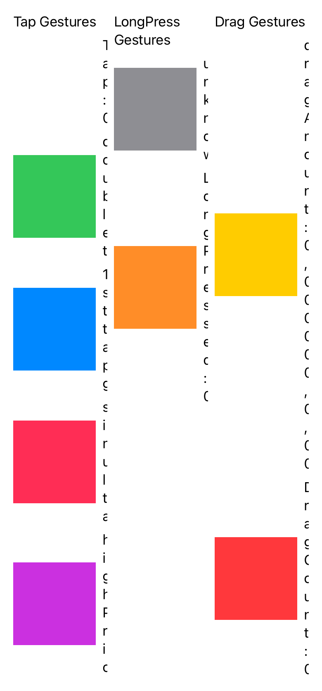 | 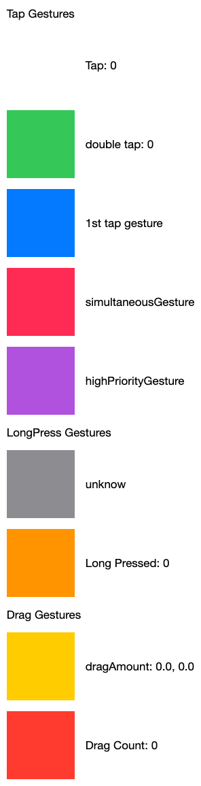 |
| Gesture & CoordinateSpace |  |  |  |  |

### Animation, State & Storage

| Status | Demo | GTK4 | Notes |
| :-: | --- | :-: | --- |
| 🚧 | Animation | ◑ | Timing/easing only; transitions render but animation timing does not persist in static capture |
| 🚧 | Transitions | ❌ | Transition states are runtime-only; static capture shows no distinct content |
| 🚧 | Environment | ❌ | Aborted before window map (runtime issue) |
| ✅ | Preferences | ◑ | Preference key demo renders (basic display; state binding GTK-limited) |
| 🚧 | AppStorage | ❌ | Aborted before window map (runtime issue) |
| ✅ | Redaction | ◑ | Redaction modifier renders (blur/redaction appears on static display) |

**Gallery** — cross-platform renders ( — = not captured on that host; see [why](../screenshots/README.md) ):

| Demo | mac | web | ios | wasm |
| --- | :-: | :-: | :-: | :-: |
| Animation | 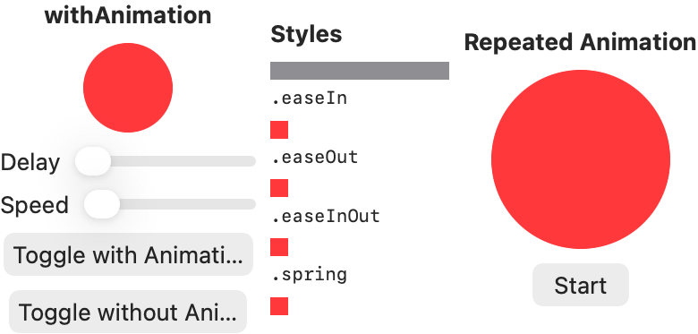 | 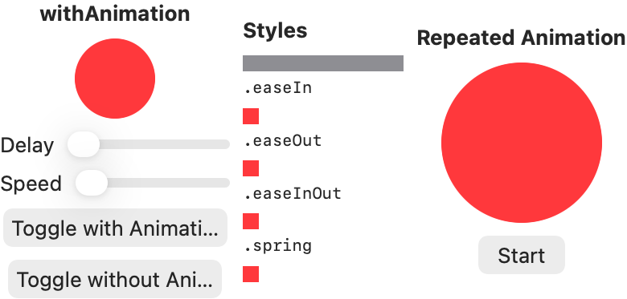 | 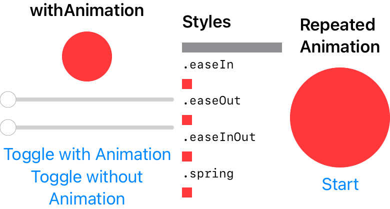 | 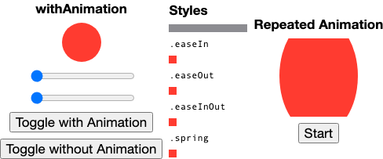 |
| Transitions |  |  |  |  |
| Environment |  | 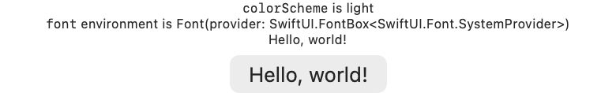 |  | 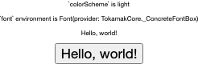 |
| Preferences | 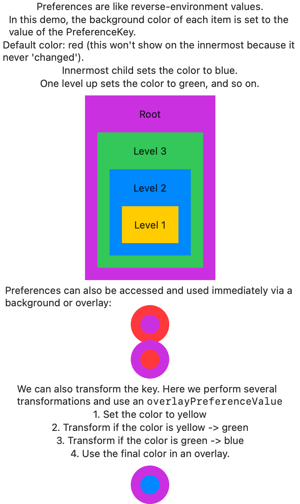 | 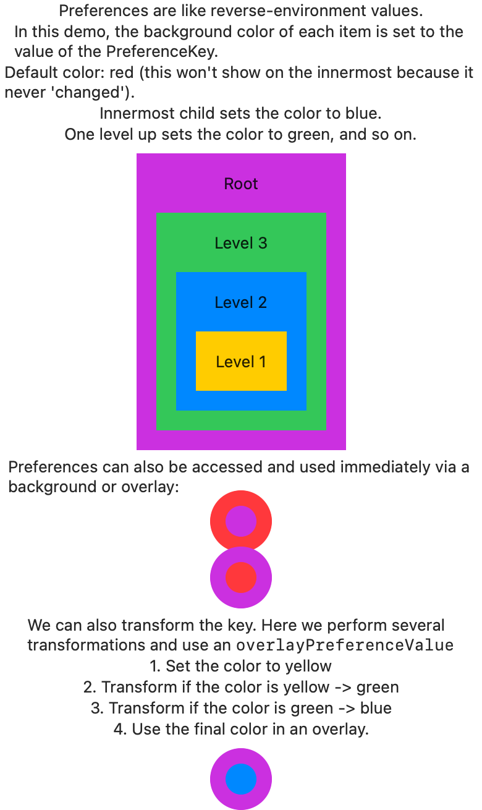 | 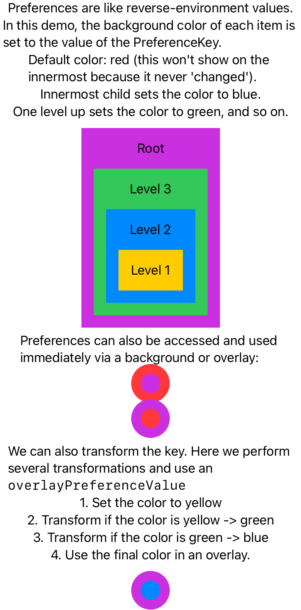 | 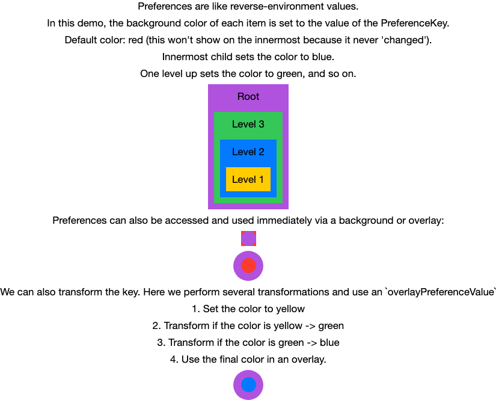 |
| AppStorage |  | 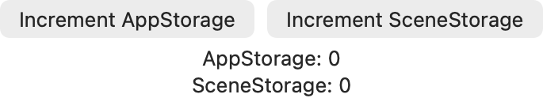 |  | 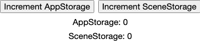 |
| Redaction |  | 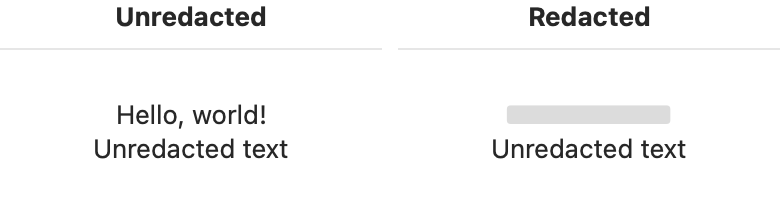 |  | 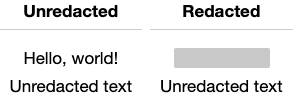 |

## View Modifiers

### Visual Effects

CSS-faithful modifiers render to equivalent CSS filters on DOM/StaticHTML. GTK4 renders modifiers as inert no-ops (no native filter API available).

| Status | Modifier | DOM | SSR | wasm | GTK4 | What's left |
| :-: | --- | :-: | :-: | :-: | :-: | --- |
| ✅ | [blur(radius:opaque:)](https://developer.apple.com/documentation/swiftui/view/blur) | ✅ | ✅ | ✅ | ➖ | GTK4 native filter API |
| ✅ | [grayscale(_:)](https://developer.apple.com/documentation/swiftui/view/grayscale) | ✅ | ✅ | ✅ | ➖ | GTK4 native filter API |
| ✅ | [brightness(_:)](https://developer.apple.com/documentation/swiftui/view/brightness) | ✅ | ✅ | ✅ | ➖ | GTK4 native filter API |
| ✅ | [contrast(_:)](https://developer.apple.com/documentation/swiftui/view/contrast) | ✅ | ✅ | ✅ | ➖ | GTK4 native filter API |
| ✅ | [saturation(_:)](https://developer.apple.com/documentation/swiftui/view/saturation) | ✅ | ✅ | ✅ | ➖ | GTK4 native filter API |
| ✅ | [hueRotation(_:)](https://developer.apple.com/documentation/swiftui/view/huerotation) | ✅ | ✅ | ✅ | ➖ | GTK4 native filter API |
| ✅ | [colorInvert()](https://developer.apple.com/documentation/swiftui/view/colorinvert) | ✅ | ✅ | ✅ | ➖ | GTK4 native filter API |
| ✅ | [colorMultiply(_:)](https://developer.apple.com/documentation/swiftui/view/colormultiply) | ✅ | ✅ | ✅ | ➖ | GTK4 native filter API (web uses SVG `feColorMatrix`) |

### Blending and Interaction

| Status | Modifier | DOM | SSR | wasm | GTK4 | What's left |
| :-: | --- | :-: | :-: | :-: | :-: | --- |
| ✅ | [blendMode(_:)](https://developer.apple.com/documentation/swiftui/view/blendmode) | ✅ | ✅ | ✅ | ➖ | GTK4 native support |
| ✅ | [allowsHitTesting(_:)](https://developer.apple.com/documentation/swiftui/view/allowshittesting) | ✅ | ✅ | ✅ | ➖ | GTK4 native support |
| ✅ | [help(_:)](https://developer.apple.com/documentation/swiftui/view/help) | ✅ | ✅ | ✅ | ➖ | GTK4 native support |

### State and Appearance

| Status | Modifier | DOM | SSR | wasm | GTK4 | What's left |
| :-: | --- | :-: | :-: | :-: | :-: | --- |
| ✅ | [disabled(_:)](https://developer.apple.com/documentation/swiftui/view/disabled) | ✅ | ✅ | ✅ | ➖ | GTK4 native support |
| ✅ | [tint(_:)](https://developer.apple.com/documentation/swiftui/view/tint) | ✅ | ✅ | ✅ | ➖ | GTK4 native support |
| ✅ | [rotation3DEffect(_:axis:anchor:anchorZ:perspective:)](https://developer.apple.com/documentation/swiftui/view/rotation3deffect) | ✅ | ✅ | ✅ | ➖ | GTK4 native support |
| ✅ | [fixedSize()](https://developer.apple.com/documentation/swiftui/view/fixedsize) / [fixedSize(horizontal:vertical:)](https://developer.apple.com/documentation/swiftui/view/fixedsize(horizontal:vertical:)) | ✅ | ✅ | ✅ | ➖ | GTK4 native support |

**Notes:**
- ✅ `colorMultiply`: renders faithfully on **both** must-pass renderers. CSS has no scalar
  `filter()` for per-channel multiply, but SVG's `feColorMatrix type="matrix"` expresses it
  exactly as a diagonal matrix (`out.r = c.r·in.r`, …). We emit it via an inline-SVG `data:` URI
  in the `filter` property (`Sources/TokamakStaticHTML/Modifiers/Effects/ColorMultiplyEffect.swift`),
  resolving the multiplier `Color` to sRGB against a default light-scheme `EnvironmentValues`
  (`DOMViewModifier.attributes` has no environment in scope, so it is seeded the same way the
  StaticHTML renderers do). DOM shares the same `DOMViewModifier` conformance. Because it emits a
  single `filter:` declaration it also stacks correctly with blur/grayscale/hueRotation. Covered
  by 4 SSR tests in `ModifierRenderingTests.swift` (data-URI shape, white→identity matrix, system
  `.blue` channel resolution, stacked-filter survival). GTK4 remains inert (no native filter API).
- ✅ CSS-faithful: All other modifiers map directly to CSS properties and render identically on DOM/StaticHTML
- GTK4: All modifiers listed above are inert no-ops on GTK4 (framework limitation; document user expectations)

**Gallery** — cross-platform renders ( — = not captured on that host; see [why](../screenshots/README.md) ):

| Demo | mac | web | ios | wasm |
| --- | :-: | :-: | :-: | :-: |
| Shadow |  |  |  | 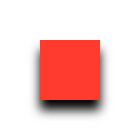 |

## Shapes, Paths, and Styles

### Shapes

| Status | View | DOM | SSR | wasm | GTK4 | What's left |
| :-: | --- | :-: | :-: | :-: | :-: | --- |
| ✅ | [Rectangle](https://developer.apple.com/documentation/swiftui/rectangle) | ✅ | ✅ | ✅ | 🚧 | GTK4 gallery verification (`GTKPrimitive` hooks exist) |
| ✅ | [RoundedRectangle](https://developer.apple.com/documentation/swiftui/roundedrectangle) | ✅ | ✅ | ✅ | 🚧 | GTK4 gallery verification |
| ✅ | [Ellipse](https://developer.apple.com/documentation/swiftui/ellipse) | ✅ | ✅ | ✅ | 🚧 | GTK4 gallery verification |
| ✅ | [Circle](https://developer.apple.com/documentation/swiftui/circle) | ✅ | ✅ | ✅ | 🚧 | GTK4 gallery verification |
| ✅ | [Capsule](https://developer.apple.com/documentation/swiftui/capsule) | ✅ | ✅ | ✅ | 🚧 | GTK4 gallery verification |

**Gallery** — cross-platform renders ( — = not captured on that host; see [why](../screenshots/README.md) ):

| Demo | mac | web | ios | wasm |
| --- | :-: | :-: | :-: | :-: |
| Shapes | 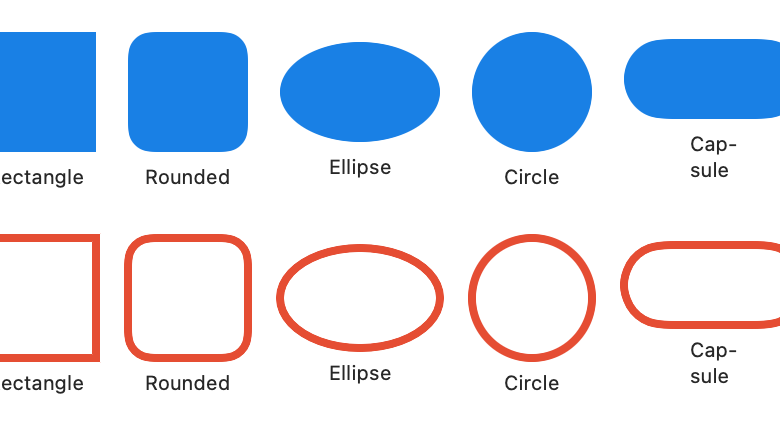 | 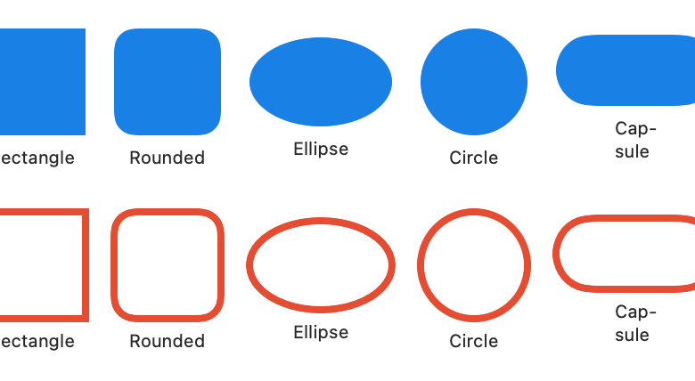 | 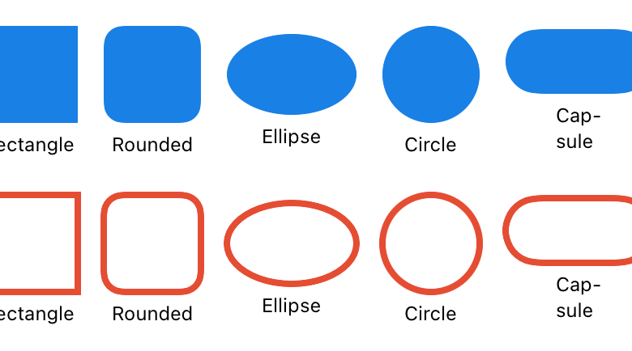 | 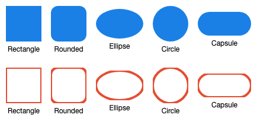 |
| Canvas | — | — | — | 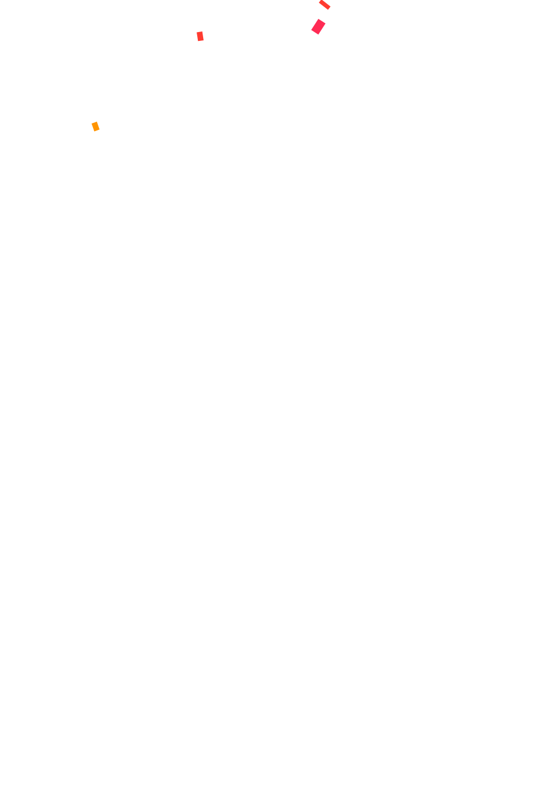 |

### Paths

| Status | View | DOM | SSR | wasm | GTK4 | What's left |
| :-: | --- | :-: | :-: | :-: | :-: | --- |
| ✅ | [Path](https://developer.apple.com/documentation/swiftui/path) | ✅ | ✅ | ✅ | 🚧 | GTK4 gallery verification |

**Gallery** — cross-platform renders ( — = not captured on that host; see [why](../screenshots/README.md) ):

| Demo | mac | web | ios | wasm |
| --- | :-: | :-: | :-: | :-: |
| Path | 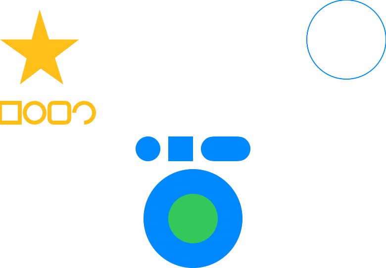 | 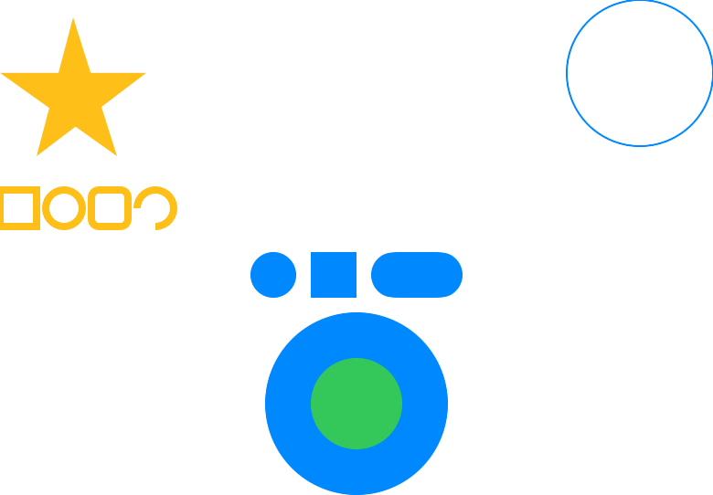 |  | 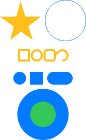 |

### Styles

| Status | View | DOM | SSR | wasm | GTK4 | What's left |
| :-: | --- | :-: | :-: | :-: | :-: | --- |
| 🚧 | [Color](https://developer.apple.com/documentation/swiftui/color) | ✅ | ✅ | ✅ | 🚧 | Dedicated `Drawing/Color` demo skipped on mac/web (ImageRenderer) — wasm authoritative; GTK4. Color **values** render everywhere |

**Notes:**
- ✅ Shapes & Path: rendered via the shared `_ShapeView`/`Path` SVG primitives
  (`Sources/TokamakStaticHTML/Shapes/`), consumed identically by StaticHTML SSR and the
  DOM renderer (`TokamakDOM` re-exports the `TokamakCore` shape types and reuses the
  `HTMLConvertible` conformances). Fill + stroke verified on mac/web via the `Drawing/Shapes`
  demo (`screenshots/{mac,web}/Shapes.png`) and `Drawing/Path` (`Path.png`); also covered by
  `Tests/TokamakStaticHTMLTests/RenderingTests/ShapeTests.swift` SSR snapshots.
- 🚧 `Color`: `Color` **values** render correctly everywhere (used throughout every demo).
  The dedicated `Drawing/Color` demo is intentionally skipped on the mac/web hosts because its
  root `ScrollView` is unrasterizable offscreen under macOS `ImageRenderer` (see
  `screenshots/README.md`); it is captured authoritatively via the wasm browser path,
  which now renders without the startup reflection trap — the wasm gallery is generated
  (51 PNGs in `screenshots/wasm/`).
- GTK4: shape primitives have `GTKPrimitive` hooks but the gallery is best-effort (no GTK4
  toolchain on the current host); GTK rendering is documented expectation, not blocking.

**Gallery** — cross-platform renders ( — = not captured on that host; see [why](../screenshots/README.md) ):

| Demo | mac | web | ios | wasm |
| --- | :-: | :-: | :-: | :-: |
| Color | — | — | — | 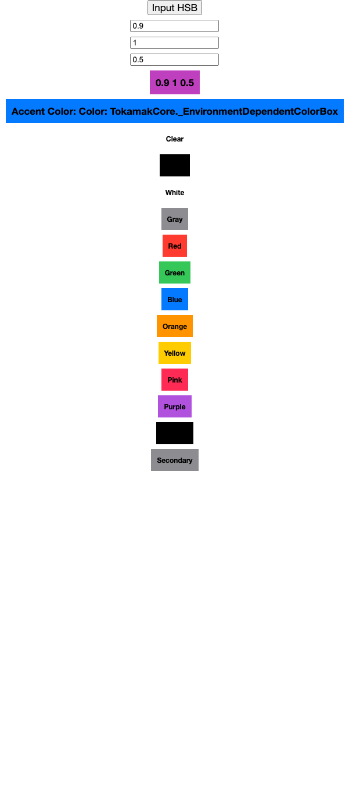 |
| Shape Styles | 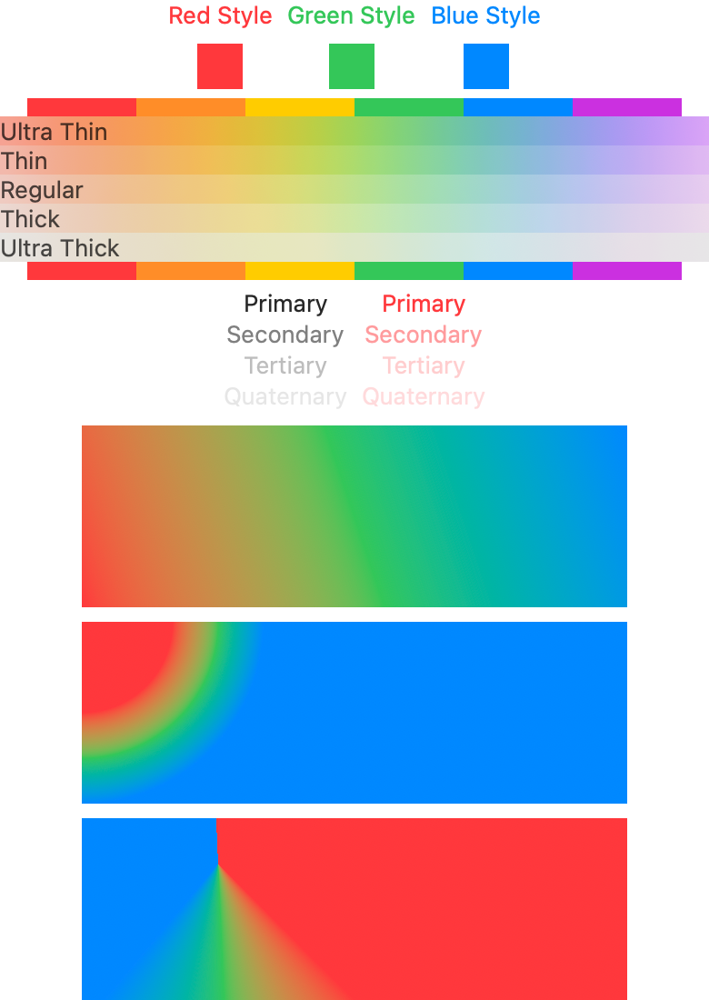 | 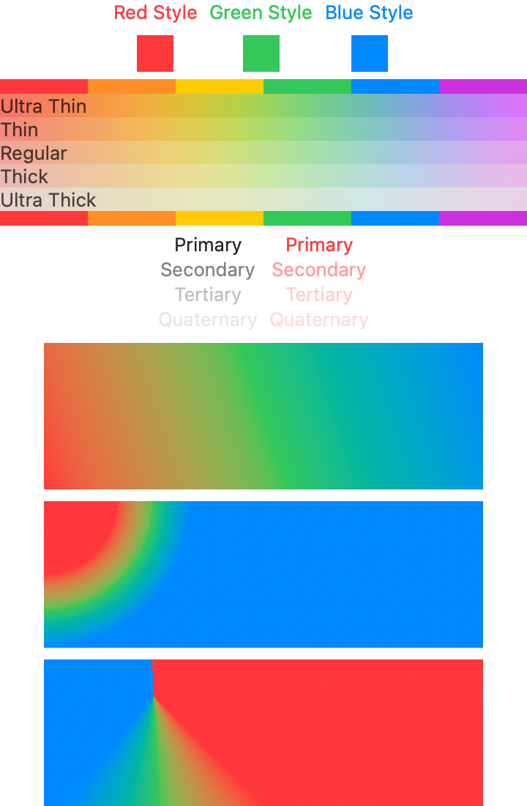 | 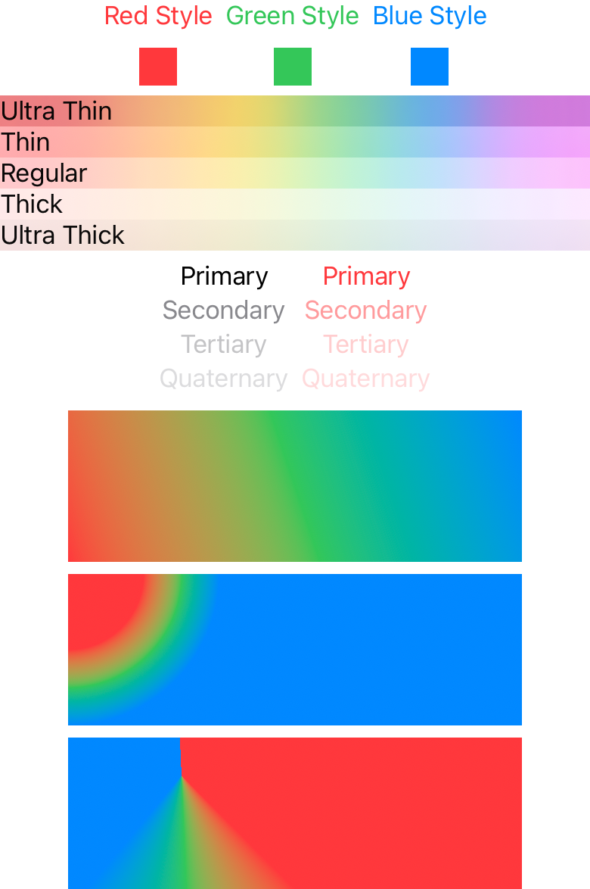 | 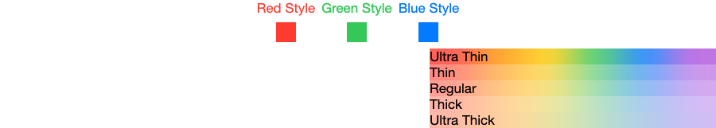 |

